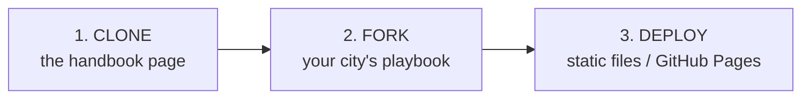
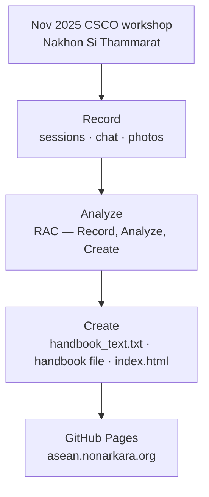

<p align="center">
  
</p>

<p align="center"><em>The tablet HUD is <strong>illustration only</strong>. Figures, nodes, and status chips in the drawing are not telemetry from this repository.</em></p>

# ASEAN CSCO working app

**The Citizen-First City** — a handbook-in-code from the November 2025 Chief Smart City Officer (CSCO) workshop in Nakhon Si Thammarat, Thailand.

**Live:** [https://asean.nonarkara.org](https://asean.nonarkara.org)

Independent civic-studio work by [Dr Non Arkaraprasertkul](https://github.com/Nonarkara) ([@Nonarkara](https://github.com/Nonarkara)). **Not an official ASEAN CSCO product.** Not an ASEAN Secretariat publication, not ASEAN policy, and not an endorsed ASEAN Smart Cities Network (ASCN) software product — see [Ethical use](#ethical-use).

---

## What this is

A static, single-page **document-in-code**: workshop notes, Nakhon Si Thammarat (NST) case material, and a short playbook kept as HTML, CSS, and JavaScript rather than a PDF that sits in a drawer.

The page is titled *The Citizen-First City — ASEAN CSCO Handbook*. **CSCO** here means **Chief Smart City Officer**, the workshop programme — not a command-and-control or supply-chain operations platform, even though the banner draws a regional HUD.

What ships in the browser:

- A manifesto and the NST four-layer model (visible services, people-centric philosophy, local ecosystem, empowered local governance)
- Four practice pillars: people, purpose, practicality, proof
- A “Steal This Idea” toolkit that copies a JSON sketch of each idea to the clipboard
- A Thailand Smart City Data Platform (SCTHCDP) concept section from the workshop
- Narrative, expandable handbook chapters, photo gallery, credits, and a reconstructed group-chat scene
- Session transcripts, slides, and related workshop files under [`2025 ASEAN CSCO Program/`](2025%20ASEAN%20CSCO%20Program/)

This repository is **not** the live municipal control tower. The flood-first NST dashboard lives in a sibling repo: [Nonarkara/nst-control-tower](https://github.com/Nonarkara/nst-control-tower). Independent ASCN analytics live in [Nonarkara/ascn-smart-cities-network](https://github.com/Nonarkara/ascn-smart-cities-network). This tree is the handbook page plus the workshop sources used to assemble it.

There is no application server, no database, and no API in this repo. GitHub Pages serves the files on `main`. Custom domain `asean.nonarkara.org` is declared in [`CNAME`](CNAME).

---

## Philosophy

Five constraints. They are how this handbook is meant to be used, not slogans on a slide.

| Tenet | What it means here |
| --- | --- |
| **Fork the method** | Steal the idea, not a brand. The toolkit copies JSON sketches on purpose. Clone the page, keep the sources visible, and adapt the playbook to another city. Do not fork a logo and call it ASEAN. |
| **One Mac** | No build step, no package manager, no vendor farm. `python3 -m http.server` on a laptop is enough. If it only works as an enterprise install, it is the wrong shape for this studio. |
| **Document-in-code** | A handbook people will actually open. Stories before theory. The workshop asked for a storybook, not a 200-page PDF. This repo is that choice made durable. |
| **Citizen-first** | Start with pain, not sensors. Technology matters when timing matters. The NST line on the page is the test: can you explain the work in one sentence a vendor did not write? |
| **Honesty labels** | Measured is not modelled. Workshop photographs are photographs. Sample dashboard cards are sample cards. A drawing of a HUD is a drawing. Label the difference when you republish. |



---

## Ethical use

This work sits in a civic-transparency practice: publish the method, do not impersonate the institution.

**This GitHub project is not an official ASEAN CSCO product.** Names, logos, and programme credits on the page describe the November 2025 workshop context (ASEAN ICT Fund, depa, ASCN, Nakhon Si Thammarat Municipality, as credited in `index.html`). They do not make this repository an ASEAN organ, a Secretariat publication, or operational software of any government. Do not imply that endorsement **unless a file in this repository explicitly documents that relationship**. This checkout does not contain such a file for the GitHub project as a product.

### Measured vs modelled

Say which layer you are looking at. Do not dress illustration or sample UI as a live operations feed.

| Surface | What it actually is |
| --- | --- |
| Manga banner HUD (`docs/hero-banner.png`) | **Illustration only.** Domain Awareness, Incident Watch, Operational Health, Weather & Sea, Supply Flow, Asset Status, Risk Posture, and the glowing ASEAN nodes are drawing — not telemetry, not this app’s UI. |
| Hero stats on the live page (app users, issue-resolution hours, flood-warning window) | NST figures **as told in the handbook narrative**. They are not live counters computed by this repository. |
| “Live Vibes Dashboard” | **Sample cards** hardcoded in [`script.js`](script.js). Not a live command-center feed, not PDPA-redacted production data. |
| LINE / Telegram “QR” graphics | Decorative SVG placeholders. Not working scanners, not a mini-app, not a bot. |
| SCTHCDP platform section | A workshop product **concept** described on the page. This repo does not ship that platform’s API or LINE mini-app. |
| Steal This Idea JSON | Static sketches in `script.js`. Starting points, not procurement packages. |
| Workshop photographs (`photos/`) | Photographs from the November 2025 workshop. |
| Transcripts and chat export | Source material from the workshop. Treat them as notes, not as an official record and not as a credential store. **Do not republish secrets** if a log happens to contain one. This README does not reprint any. |
| Handbook PDF / `handbook_text.txt` | Source used while assembling the page. The root file is named `.pdf`; open it locally and trust what the bytes are, not only the extension. |

**Do not:**

- Present this repo, the banner, or a fork as official ASEAN CSCO, ASEAN Secretariat, ASCN, depa, or municipal operations software.
- Treat modelled, sample, or illustrated figures as measured sensor or citizen data.
- Use the page as a live flood, logistics, or public-safety system. For NST operations software, see [nst-control-tower](https://github.com/Nonarkara/nst-control-tower) — and even there, follow official warning channels.
- Commit secrets. This tree has no `.env` and needs none. Do not invent API keys, bot tokens, or LINE credentials to “complete” the QR placeholders.
- Strip provenance when you republish workshop stories or NST figures. Keep the measured-vs-modelled labels.

The page footer still mentions CC BY-NC 4.0 and institutional copyright lines. That is **existing site copy** in `index.html`, not a second SPDX file and not proof that this GitHub project is an official ASEAN product. See [License](#license).

---

## How it works

Workshop material was recorded, synthesised, and turned into one static page. GitHub Pages serves it.



What the page actually loads:

| Path | Role |
| --- | --- |
| [`index.html`](index.html) | Single-page handbook |
| [`style.css`](style.css) | Layout and theme |
| [`script.js`](script.js) | Nav, scroll reveal, toolkit clipboard copy, sample dashboard cards |
| [`assets/favicon.svg`](assets/favicon.svg) | Favicon |
| [`photos/`](photos/) | Workshop photographs and logo assets referenced by the page |
| [`handbook_text.txt`](handbook_text.txt) | Plain-text handbook source used while assembling the page |
| [`The Citizen-First City_ An ASEAN Handbook for Chief Smart City Officers.pdf`](The%20Citizen-First%20City_%20An%20ASEAN%20Handbook%20for%20Chief%20Smart%20City%20Officers.pdf) | Handbook source file in the repo root |
| [`2025 ASEAN CSCO Program/`](2025%20ASEAN%20CSCO%20Program/) | Transcripts, slides, concept notes, and supporting workshop documents |
| [`CNAME`](CNAME) | GitHub Pages custom domain: `asean.nonarkara.org` |
| [`docs/hero-banner.png`](docs/hero-banner.png) | README illustration |

[`script.js`](script.js) does four things in the browser: sticky nav, a mobile menu, IntersectionObserver scroll-reveal, clipboard copy for the six toolkit ideas, and injection of four sample “vibes” cards into `#gdelt-feed`. There is no network call to GDELT or any other live feed. The page loads fonts from Google Fonts; everything else is static files in this repository.

The reconstructed WhatsApp-style thread on the page is editorial presentation of workshop-era messages, not a live chat client.

---

## How to run / fork

No build step, no package manager, no environment variables, no secrets.

### View it

Open the live URL: [https://asean.nonarkara.org](https://asean.nonarkara.org) (GitHub Pages, custom domain from `CNAME`).

### Run locally

```bash
git clone https://github.com/Nonarkara/asean-csco-app.git
cd asean-csco-app
python3 -m http.server 8000
```

Then open [http://localhost:8000](http://localhost:8000). You can open `index.html` as a file; some browsers restrict clipboard and local paths, so a static server is more reliable.

### Fork

1. Fork [Nonarkara/asean-csco-app](https://github.com/Nonarkara/asean-csco-app).
2. Change [`CNAME`](CNAME) to **your** domain, or delete it and use GitHub Pages’ default `*.github.io` URL.
3. Edit `index.html` for your city. Keep honesty labels: sample widgets stay sample; illustrated HUDs stay illustration.
4. Do not copy secrets from workshop transcripts into config, and do not invent LINE/Telegram credentials to match the placeholder QR art.
5. Do not describe your fork as an official ASEAN CSCO product unless you add a file that actually documents that relationship.

Enable GitHub Pages from `main` (site source: `/`) the same way this repo does, or serve the files from any static host.

---

## License

MIT. See [`LICENSE`](LICENSE). Copyright (c) 2025 Non Arkaraprasertkul.

Software in this repository (the HTML/CSS/JS page and this documentation) is MIT-licensed. Workshop photographs, institutional logos, and third-party PDFs remain under the terms of their originators. The live page footer still shows a CC BY-NC 4.0 line attributed to depa / ASCN / ASEAN Secretariat — that is existing copy in `index.html`, left unchanged here.

Fork the method. Keep the ethic. Do not pretend this GitHub project is ASEAN.
